# Understanding Real-Estate Market in Estonia
Estonia is considered a high-income economy by the World Bank in the European Union. The estimated GDP (PPP) per capita of the country would be  $37,605 in 2020 according to the International Monetary Fund. Estonia has often been described as a Baltic Tiger because of its rapid growth. 

In order to understand the economy better, real estate is a good indicator. the price of the listings are going up every year and there has been very little study in this area to understand the growth rate and socio economic factors that might have caused the surge. This project has been undertaken by Experiemntal Team of Statistics Estonia and supervised by Arko Kesküla, company supervisor and Rajesh Sharma, academic supervisor from the University of Tartu. 

## Objective
The objectives of the project are the followings
* Prepare an exploratory data analysis
* Develope machine learning models for predicting real estate price, future appreciation, and classification, 
* Understanding real estate bubble in certain areas. 
* Mapping the listings on an open street map (OSM) and showing the data in an interactive environment. 

## Methodology
The data is scrapped from kv.ee, as a result, data etching, transforming, loading (ETL cycle) will be performed on top of the analysis. 
The steps are as followed;
* Data Collection
* Initial Preprocessing
* Exploratory Data Analysis
* Data Cleaning
*
*
*
*

### Data Collection
Data have been colected using the scrapper.py script from kv.ee website. It took around 18 hours to collect all the 26,309 instances. For scrapping data from any website, the important part is to understand the strucure of the website. My supervisor, Arko, helped me writing the scrapper on which I improvised it slightly. 

The following tables shows how the raw data looks;

|    | date       | name                                                                                |   rooms | totalarea   |   landarea | price     | pricesqm   | numoffloor   | geoloc                            |   builtyear | energymark   | condition   | link                                                                                                                                |
|---:|:-----------|:------------------------------------------------------------------------------------|--------:|:------------|-----------:|:----------|:-----------|:-------------|:----------------------------------|------------:|:-------------|:------------|:------------------------------------------------------------------------------------------------------------------------------------|
|  0 | 2020-03-25 | Müüa korter, 2 tuba - Sitsi 14a-5, Sitsi, Põhja-Tallinn, Tallinn, Harjumaa          |       2 | 50.2 m²     |          2 | 140 000 € | 2 789 €/m2 | 3/3          | 59.4520609,24.7017383             |        2020 | B            | Uus         | https://www.kv.ee/muua-uus-2toaline-korter-2020-a-sugisel-valmivas-u-3192088.html?nr=1&search_key=c969965abaf64f3b5db75e0e0c896ab1  |
|  1 | 2020-03-25 | Anda üürile korter, 2 tuba - Tõnismägi 11A, Tõnismägi, Kesklinn, Tallinn, Harjumaa  |       2 | 54.4 m²     |          2 | 800 €     | 14.7 €/m2  | 4/7          | 59.4295558,24.7424516             |        2019 | B            | Uus         | https://www.kv.ee/uurile-on-anda-asja-valminud-sisustatud-korter-ton-3215615.html?nr=2&search_key=c969965abaf64f3b5db75e0e0c896ab1  |
|  2 | 2020-03-25 | Müüa korter, 2 tuba - Riia 20a, Riia kvartal, Kesklinn, Tartu linn, Tartu, Tartumaa |       2 | 43 m²       |          2 | 104 000 € | 2 419 €/m2 | 1/8          | 58.3716346051467,26.7195677645569 |        2021 | B            | Uus         | https://www.kv.ee/tapsema-info-saamiseks-kulastage-arenduse-riia-kva-3220698.html?nr=3&search_key=c969965abaf64f3b5db75e0e0c896ab1  |
|  3 | 2020-03-25 | Müüa korter, 3 tuba - Tähe 19-7, Kesklinn, Tartu linn, Tartu, Tartumaa              |       3 | 56.3 m²     |          3 | 157 600 € | 2 799 €/m2 | 2/4          | 58.3702863,26.7270915             |         nan | B            | nan         | https://www.kv.ee/endise-restoran-kaseke-asemele-rajatakse-modernne-3188742.html?nr=4&search_key=c969965abaf64f3b5db75e0e0c896ab1   |
|  4 | 2020-03-25 | Müüa korter, 3 tuba - Riia 20b, Riia kvartal, Kesklinn, Tartu linn, Tartu, Tartumaa |       3 | 61.5 m²     |          3 | 140 000 € | 2 276 €/m2 | 1/7          | 58.3714770688946,26.7197179682617 |        2020 | B            | Uus         | https://www.kv.ee/tapsema-info-saamiseks-kulastage-arenduse-riia-kva-3162151.html?nr=5&search_key=c969965abaf64f3b5db75e0e0c896ab1  |
```
Datatypes
date           object
name           object
rooms          object
totalarea      object
landarea       object
price          object
pricesqm       object
numoffloor     object
geoloc         object
builtyear     float64
energymark     object
condition      object
link           object
dtype: object
```
### Initial Preprocessing
After the data were collected, it has been observed that some of the column holds data of another column. It happened because of inconsistent structure of the website. Although other elemnts have been handled during the scrapping session, some still had to be placed in their right position. Simply removing the value would increase the number of empty cells and which will directly impact on the data. initial_preprocessing.py script was used to perform this initial preprocessing steps. This script also converts the data type from object to string or integer or float as required and also the units are removed for ease of calculation.

After initial preprocessing the data looks much cleaner. Following is table showing first ten instances, 
|    | date       | name                                                                                                                                         | rooms   | totalarea   | landarea   | price    | pricesqm   | numoffloor   | builtyear   | energymark   | condition          | link                                                                                                                               | listing_type   | county      | obj_type         | latitude         | longitude        |
|:---|:-----------|:---------------------------------------------------------------------------------------------------------------------------------------------|:--------|:------------|:-----------|:---------|:-----------|:-------------|:------------|:-------------|:-------------------|:-----------------------------------------------------------------------------------------------------------------------------------|:---------------|:------------|:-----------------|:-----------------|:-----------------|
| 0  | 2020-03-21 | Müüa äripind, ladu, tootmine, tootmine, ladu, teenindus, kaubandus, büroo, 3 239,7 m² - Tööstuspargi 2, Voka alevik, Toila vald, Ida-Virumaa | 10.0    | 3239.7      | nan        | 130000.0 | 40.1       | 2            | 1995.0      | nan          | Vajab san. remonti | https://www.kv.ee/tootmishoonekulmladutoostuslik-kalasuitsetamineteh-3214303.html?nr=1&search_key=c969965abaf64f3b5db75e0e0c896ab1 | sale           | ida-virumaa | commercial_space | 59.4022452       | 27.5802792       |
| 1  | 2020-03-21 | Müüa korter, 3 tuba - Riia 20b, Riia kvartal, Kesklinn, Tartu linn, Tartu, Tartumaa                                                          | 3.0     | 61.5        | nan        | 140000.0 | 2276.0     | 1/7          | 2020.0      | b            | Uus                | https://www.kv.ee/tapsema-info-saamiseks-kulastage-arenduse-riia-kva-3162151.html?nr=2&search_key=c969965abaf64f3b5db75e0e0c896ab1 | sale           | tartumaa    | apartment        | 58.3714770688946 | 26.7197179682617 |
| 2  | 2020-03-21 | Anda üürile korter, 1 tuba - TÄHETORNI 31, Nõmme, Tallinn, Harjumaa                                                                          | 1.0     | nan         | nan        | 3.65     | 0.0        | -            | nan         | nan          | nan                | https://www.kv.ee/tuba-kahele-7-30-eur-paev-rendile-anda-tuba-kahele-3213086.html?nr=3&search_key=c969965abaf64f3b5db75e0e0c896ab1 | rent           | harjumaa    | apartment        | 59.3870961       | 24.6384003       |

```
Datatypes
date             object
name             object
rooms           float64
totalarea       float64
landarea        float64
price           float64
pricesqm        float64
numoffloor       object
builtyear       float64
energymark       object
condition        object
link             object
listing_type     object
county           object
obj_type         object
latitude        float64
longitude       float64
dtype: object
```

### Exploratory Data Analysis
The dataframe has the following features and elements, <br>
```
Information
<class 'pandas.core.frame.DataFrame'>
Int64Index: 26309 entries, 0 to 26308
Data columns (total 17 columns):
 #   Column        Non-Null Count  Dtype  
---  ------        --------------  -----  
 0   date          26309 non-null  object 
 1   name          25837 non-null  object 
 2   rooms         17701 non-null  float64
 3   totalarea     18713 non-null  float64
 4   landarea      7799 non-null   float64
 5   price         25752 non-null  float64
 6   pricesqm      25644 non-null  float64
 7   numoffloor    25692 non-null  object 
 8   builtyear     12997 non-null  float64
 9   energymark    9337 non-null   object 
 10  condition     11181 non-null  object 
 11  link          26309 non-null  object 
 12  listing_type  25837 non-null  object 
 13  county        25837 non-null  object 
 14  obj_type      26309 non-null  object 
 15  latitude      25452 non-null  float64
 16  longitude     25452 non-null  float64
dtypes: float64(8), object(9)
memory usage: 4.9+ MB
```
Mean and standard deviation of the usable features were calculated afterwards to understand the distribution of the data. 

```
Mean of the features
rooms        3.048924e+00
totalarea    4.061684e+07
landarea     1.724522e+04
price        1.034639e+05
pricesqm     8.104609e+02
builtyear    1.992222e+03
latitude     5.899602e+01
longitude    2.528726e+01
dtype: float64
Standard Deviation of the features
rooms        2.005834e+00
totalarea    3.930508e+09
landarea     9.210906e+04
price        2.158014e+05
pricesqm     1.039888e+03
builtyear    3.310879e+01
latitude     1.709282e+00
longitude    5.094627e+00
dtype: float64
```
After calculating the mean and standard deviation, we can gather initial idea of the dataset. Mean and std of totalarea seems a bit high, could be becuase of different object type. We will tace care of that later. 

Number of missing values are as visualized as follows, 

The missing values in percentage are as follows,
```
date             0.000000
name             1.794063
rooms           32.718841
totalarea       28.872249
landarea        70.356152
price            2.117146
pricesqm         2.527652
numoffloor       2.345205
builtyear       50.598654
energymark      64.510244
condition       57.501235
link             0.000000
listing_type     1.794063
county           1.794063
obj_type         0.000000
latitude         3.257440
longitude        3.257440
dtype: float64
```


The dataset gives us interesting information regarding Estonian Realestate Market. 

### Apartment
## Room
At first we look at the object type categorized as apartment. 
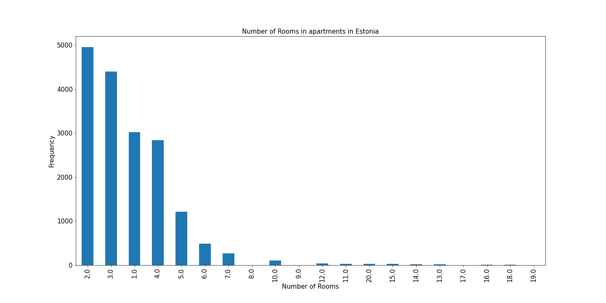

From the bar plot, we can see most of the listed apartments have 1 to 5 rooms. And listings with 2 rooms are the highest in number which also represents the demand for 2 and 3 room apartments in Estonian Realestate market. 

Further segregation of the rooms apartment according to listing type, "sale" and "rent" is shown in the following bar plot. 
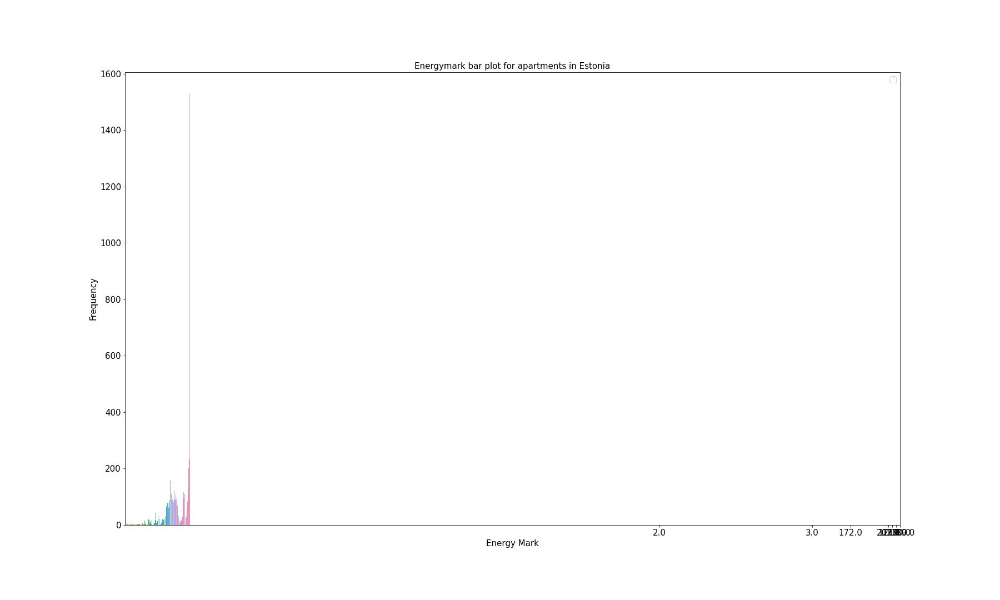

The diagram shows that the demand for renting 1 room apartment is higher than listings for sale. On the otherhand, sale listings with 2,3,4,5 room are higher in number than renting similar apartments. This may indicate that people look to buy bigger houses and rent smaller one. 3 room apartments are the highest listing in the recent (2020 Pre-COVID-19) real estate market. 

## Energy Mark
The dataset also holds energymarks available for the listings. In this following plot, we can see a bar plot of energy marks of the apartments. 
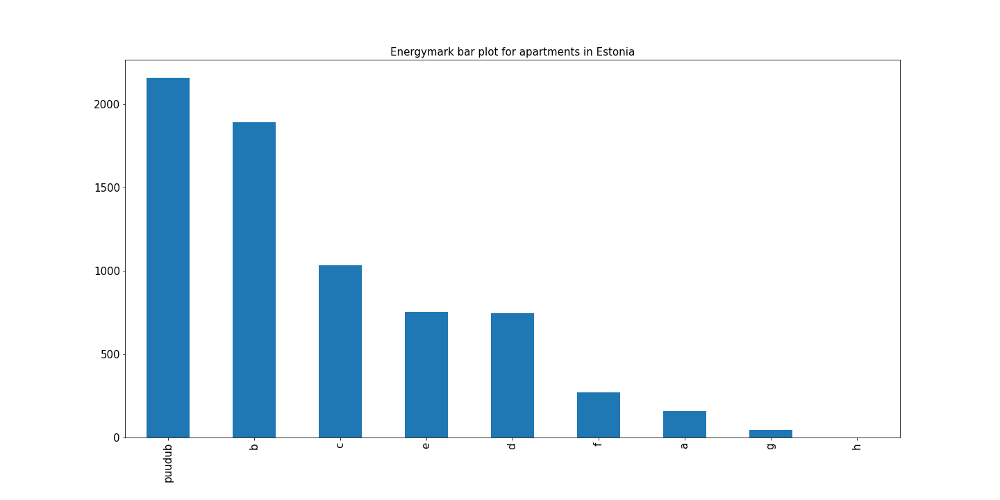
From the figure, we can see that most of the listings do not have energy marks (puudub) and the next highest is B graded listings and so on. Apartments with energy efficient equipments (energy mark: A) is very low. 

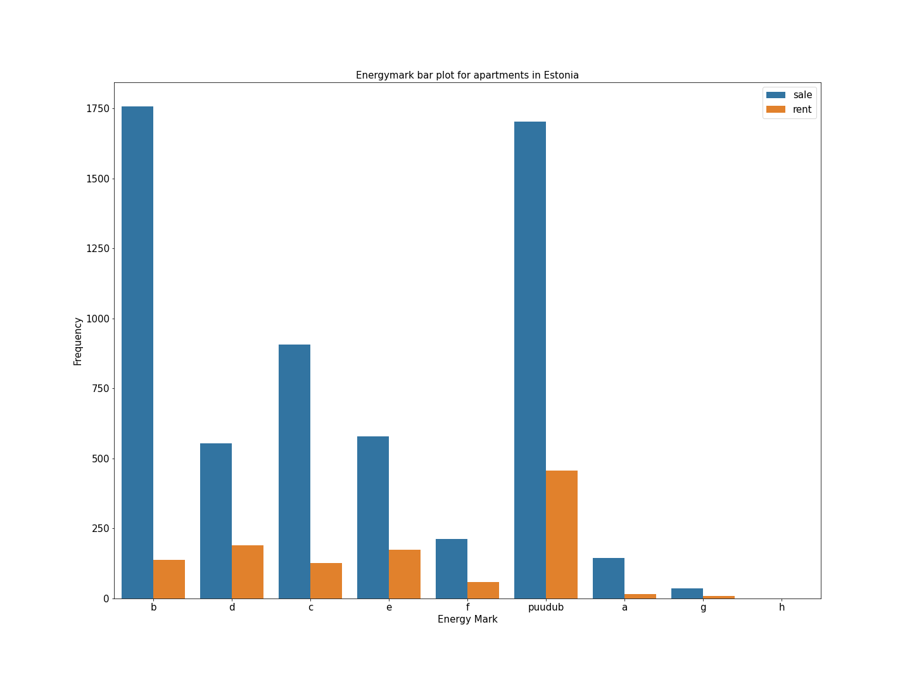
Mostly, the new apartments, have A graded appliences which are up for sale and the others are B,D,C,E. 


## Price 
The dataset also includes the vital information, price of the listed apartments. The following histogram shows all the apartments available for rent and sale. 

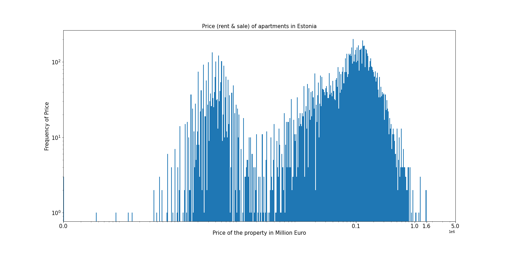

After dividing the listings between rent and sale properties, we find the following histograms. 
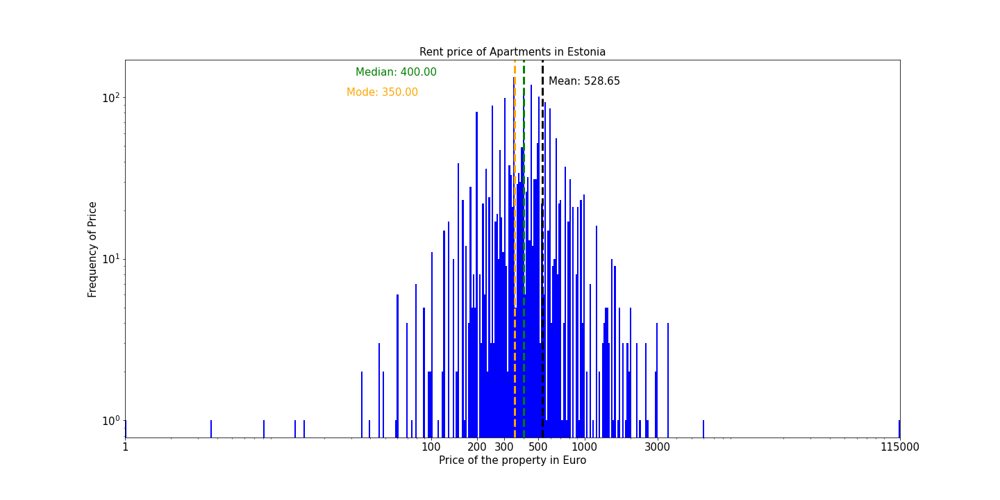
Most of the rents are between 200 and 1000 euro where median is 400 Euro, Mean is 528.65 Euro, Mode is 350 Euro

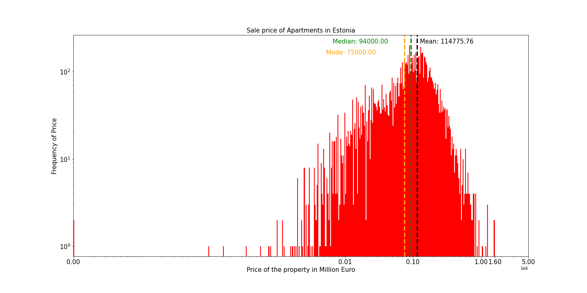
Most of the apartments are for sale are between 10,000 Euro and 1,000,000 euro where median is 94,000 Euro, Mean is 114,775.76 Euro, Mode is 75,000 Euro

## Price per square meter (Pricesqm)
From the pricesqm column of the listed apartments, we can visualize the distribution.


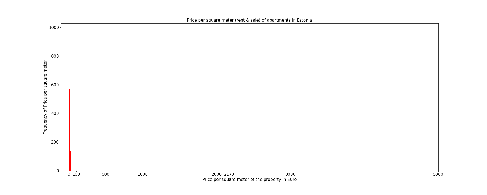
After separating the rent listings, we can see that the distribution is very skewed becuase of some high values whereas almost all the listings fall in the range of 0 to 50. So, we visualized another disribution of pricesqm under 50 Euro. 

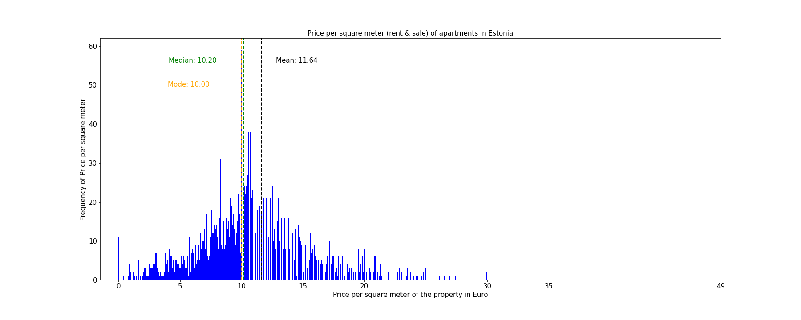
Price per square meter of most of the rent-properties are around 10 Euro, where median is 10.20 Euro, Mean is 11.64 Euro, Mode is 10 Euro. 
The mean, median, mode are calculated taking into consideration of values that are larger than 50. 

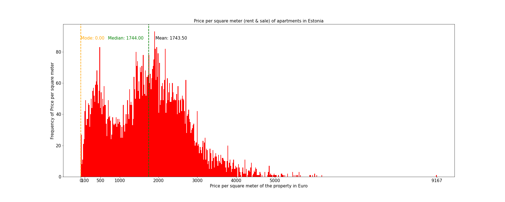
Price per square meter of most of the sale-properties are under 4000 Euro, where median is 1744 Euro, Mean is 1743.50 Euro, Mode is 0 Euro becuase of some lsitings that has 0 Euro as pricesqm which is highest in number.


## Price per square meter (Pricesqm)
According to the builtyear column, we prepared a log scale visualization. 
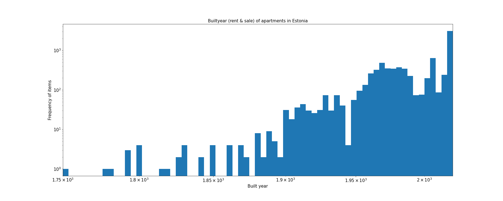

And the following is a natural scale bar plot, 
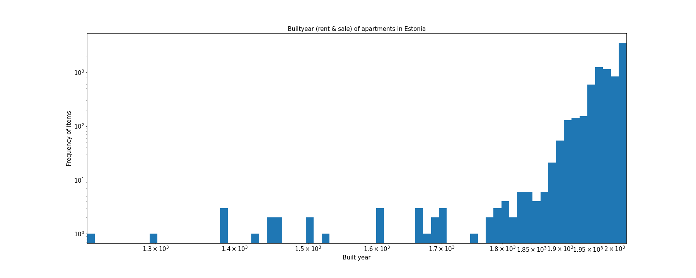

After, dividing the dataset into rent and sale, we get the followings, 
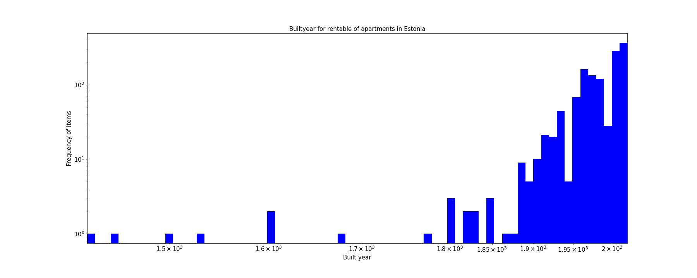
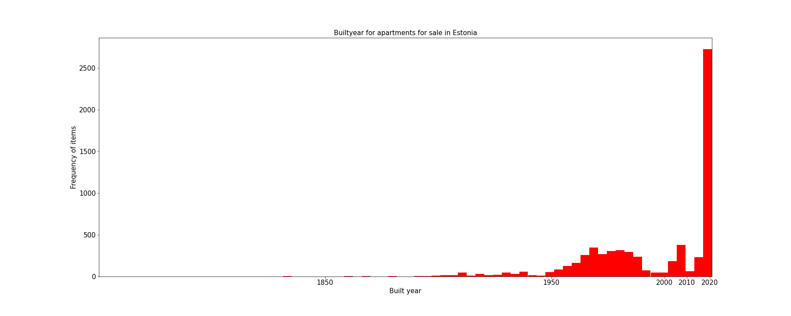

From, both of the plots, we can figure out that there is a boom in 2020 in building new apartment buildings. The second highest peak is between 2000 and 2010 when Estonia became a member of European Union. 


******under review********

In the following plot, we are observing the total area of the property based on their standard deviation. 


From the plot, we can see that we have data with standard deviation close to 100. So, we have to perform some data cleaning. At first we removed the two highest values which seemed very unrealistic and plotted the standard deviation again as follows. 

Still we can see that we have data as high as 70 or so and most of the points are clustered under 20 std. 

After, removing those values, we can still see that our data is clustered under 5 standard deviation. The reason behind this is there are some listing which are actually not an apartment rather a land which is why the deviation. 
Now, we will split the data set into two based on their standard deviation and keep one part that is in 5th standard deviation one one dataframe and the other which is higher than 5th standard deviation. 

The following is the plot of the instances that we believe are apartmnets based on totalarea. 


Still we can see that the histogram is very skewed. I think we can clean further and get more acceptable data.


