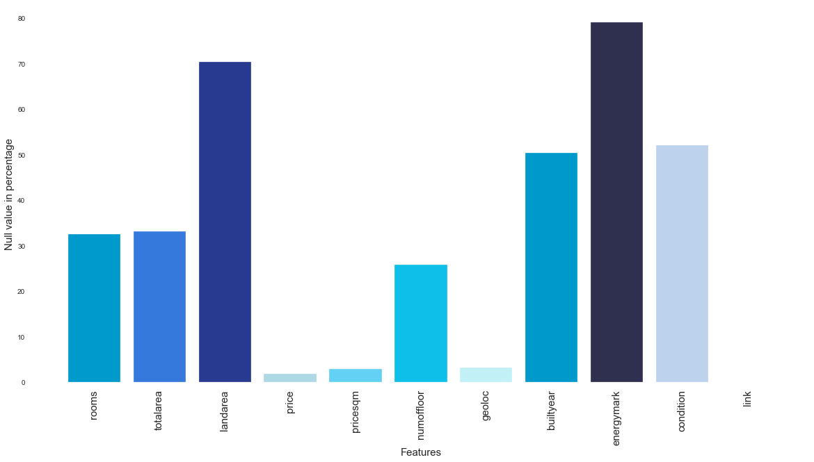
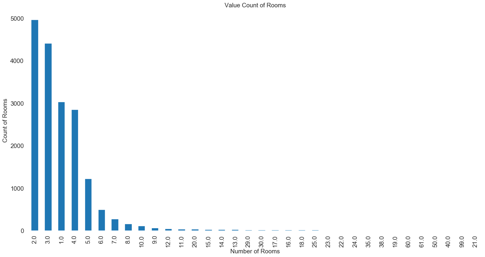
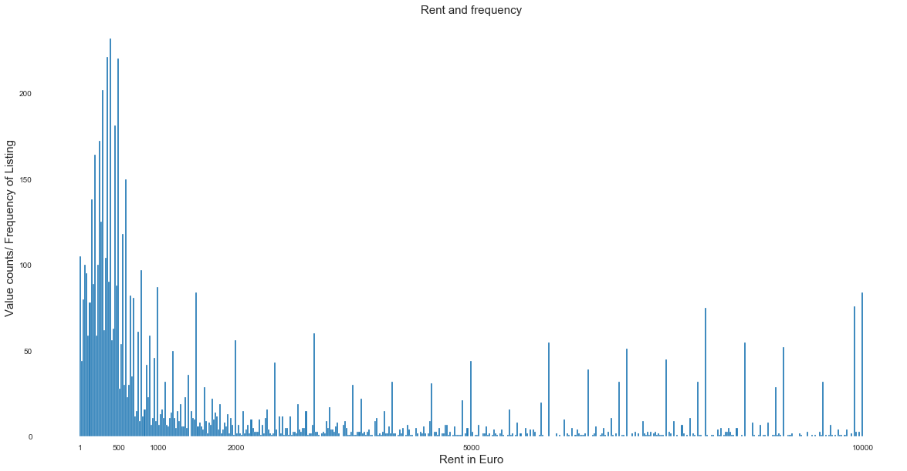
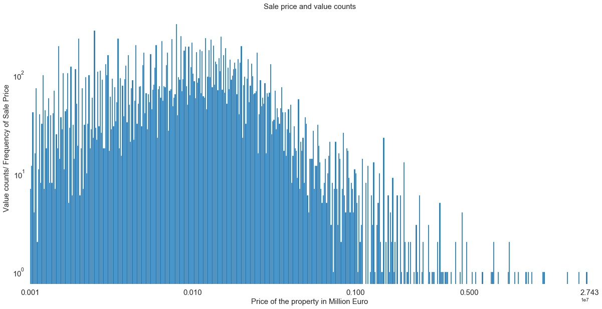
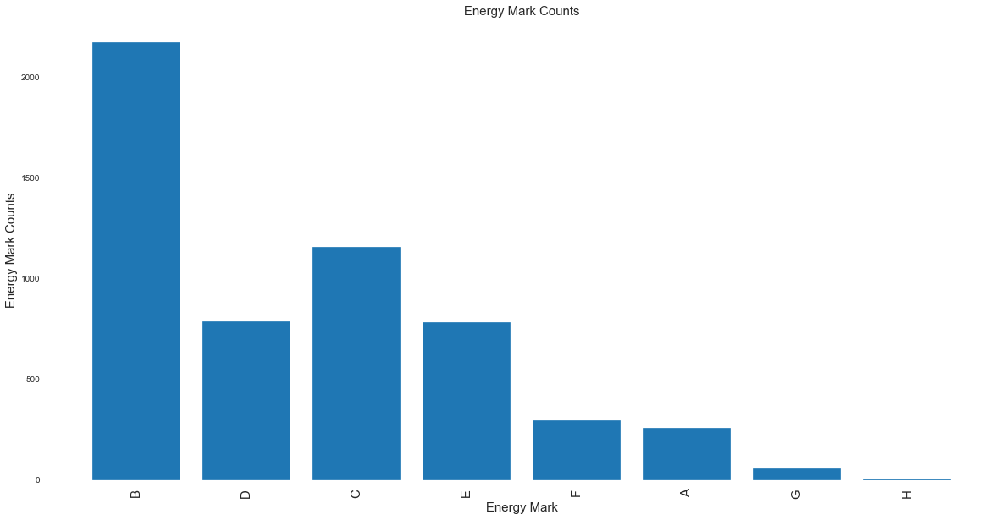
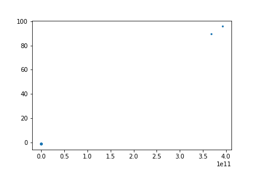
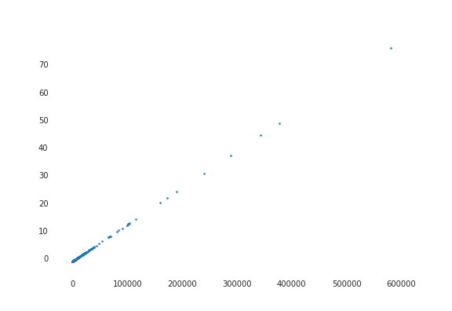
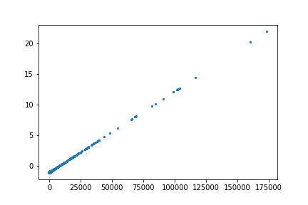
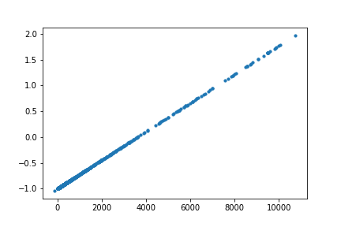
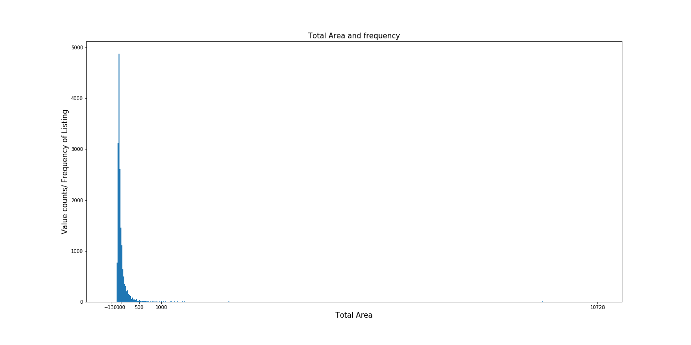

# Understanding Real-Estate Market in Estonia
Estonia is considered a high-income economy by the World Bank in the European Union. The estimated GDP (PPP) per capita of the country would be  $37,605 in 2020 according to the International Monetary Fund. Estonia has often been described as a Baltic Tiger because of its rapid growth. 

In order to understand the economy better, real estate is a good indicator. the price of the listings are going up every year and there has been very little study in this area to understand the growth rate and socio economic factors that might have caused the surge. This project has been undertaken by Experiemntal Team of Statistics Estonia and supervised by Arko Kesküla, company supervisor and Rajesh Sharma, academic supervisor from the University of Tartu. 

## Objective
The objectives of the project are the followings
* Prepare an exploratory data analysis
* Develope machine learning models for predicting real estate price, future appreciation, and classification, 
* Understanding real estate bubble in certain areas. 
* Mapping the listings on an open street map (OSM) and showing the data in an interactive environment. 

## Methodology
The data is scrapped from kv.ee, as a result, data etching, transforming, loading (ETL cycle) will be performed on top of the analysis. 
The steps are as followed;
* Data Collection
* Initial Preprocessing
* Exploratory Data Analysis
* Data Cleaning
*
*
*
*

### Data Collection
Data have been colected using the scrapper.py script from kv.ee website. It took around 18 hours to collect all the 26,309 instances. For scrapping data from any website, the important part is to understand the strucure of the website. My supervisor, Arko, helped me writing the scrapper on which I improvised it slightly. 

The following tables shows how the raw data looks;

|    | date       | name                                                                                |   rooms | totalarea   |   landarea | price     | pricesqm   | numoffloor   | geoloc                            |   builtyear | energymark   | condition   | link                                                                                                                                |
|---:|:-----------|:------------------------------------------------------------------------------------|--------:|:------------|-----------:|:----------|:-----------|:-------------|:----------------------------------|------------:|:-------------|:------------|:------------------------------------------------------------------------------------------------------------------------------------|
|  0 | 2020-03-25 | Müüa korter, 2 tuba - Sitsi 14a-5, Sitsi, Põhja-Tallinn, Tallinn, Harjumaa          |       2 | 50.2 m²     |          2 | 140 000 € | 2 789 €/m2 | 3/3          | 59.4520609,24.7017383             |        2020 | B            | Uus         | https://www.kv.ee/muua-uus-2toaline-korter-2020-a-sugisel-valmivas-u-3192088.html?nr=1&search_key=c969965abaf64f3b5db75e0e0c896ab1  |
|  1 | 2020-03-25 | Anda üürile korter, 2 tuba - Tõnismägi 11A, Tõnismägi, Kesklinn, Tallinn, Harjumaa  |       2 | 54.4 m²     |          2 | 800 €     | 14.7 €/m2  | 4/7          | 59.4295558,24.7424516             |        2019 | B            | Uus         | https://www.kv.ee/uurile-on-anda-asja-valminud-sisustatud-korter-ton-3215615.html?nr=2&search_key=c969965abaf64f3b5db75e0e0c896ab1  |
|  2 | 2020-03-25 | Müüa korter, 2 tuba - Riia 20a, Riia kvartal, Kesklinn, Tartu linn, Tartu, Tartumaa |       2 | 43 m²       |          2 | 104 000 € | 2 419 €/m2 | 1/8          | 58.3716346051467,26.7195677645569 |        2021 | B            | Uus         | https://www.kv.ee/tapsema-info-saamiseks-kulastage-arenduse-riia-kva-3220698.html?nr=3&search_key=c969965abaf64f3b5db75e0e0c896ab1  |
|  3 | 2020-03-25 | Müüa korter, 3 tuba - Tähe 19-7, Kesklinn, Tartu linn, Tartu, Tartumaa              |       3 | 56.3 m²     |          3 | 157 600 € | 2 799 €/m2 | 2/4          | 58.3702863,26.7270915             |         nan | B            | nan         | https://www.kv.ee/endise-restoran-kaseke-asemele-rajatakse-modernne-3188742.html?nr=4&search_key=c969965abaf64f3b5db75e0e0c896ab1   |
|  4 | 2020-03-25 | Müüa korter, 3 tuba - Riia 20b, Riia kvartal, Kesklinn, Tartu linn, Tartu, Tartumaa |       3 | 61.5 m²     |          3 | 140 000 € | 2 276 €/m2 | 1/7          | 58.3714770688946,26.7197179682617 |        2020 | B            | Uus         | https://www.kv.ee/tapsema-info-saamiseks-kulastage-arenduse-riia-kva-3162151.html?nr=5&search_key=c969965abaf64f3b5db75e0e0c896ab1  |


### Initial Preprocessing
After the data were collected, it has been observed that some of the column holds data of another column. It happened because of inconsistent structure of the website. Although other elemnts have been handled during the scrapping session, some still had to be placed in their right position. Simply removing the value woudl increase the number of empty cells and which will directly impact on the data. initial_preprocessing.py script was used to perform this initial preprocessing steps. This script also converts the data type from object to string or integer or float as required and also the units are removed for ease of calculation.

After initial preprocessing the data looks much cleaner. Following is table showing first ten instances, 
|    | date       | name                                                                                                                                         | rooms   | totalarea   | landarea   | price    | pricesqm   | numoffloor   | builtyear   | energymark   | condition          | link                                                                                                                               | listing_type   | county      | obj_type         | latitude         | longitude        |
|:---|:-----------|:---------------------------------------------------------------------------------------------------------------------------------------------|:--------|:------------|:-----------|:---------|:-----------|:-------------|:------------|:-------------|:-------------------|:-----------------------------------------------------------------------------------------------------------------------------------|:---------------|:------------|:-----------------|:-----------------|:-----------------|
| 0  | 2020-03-21 | Müüa äripind, ladu, tootmine, tootmine, ladu, teenindus, kaubandus, büroo, 3 239,7 m² - Tööstuspargi 2, Voka alevik, Toila vald, Ida-Virumaa | 10.0    | 3239.7      | nan        | 130000.0 | 40.1       | 2            | 1995.0      | nan          | Vajab san. remonti | https://www.kv.ee/tootmishoonekulmladutoostuslik-kalasuitsetamineteh-3214303.html?nr=1&search_key=c969965abaf64f3b5db75e0e0c896ab1 | sale           | ida-virumaa | commercial_space | 59.4022452       | 27.5802792       |
| 1  | 2020-03-21 | Müüa korter, 3 tuba - Riia 20b, Riia kvartal, Kesklinn, Tartu linn, Tartu, Tartumaa                                                          | 3.0     | 61.5        | nan        | 140000.0 | 2276.0     | 1/7          | 2020.0      | b            | Uus                | https://www.kv.ee/tapsema-info-saamiseks-kulastage-arenduse-riia-kva-3162151.html?nr=2&search_key=c969965abaf64f3b5db75e0e0c896ab1 | sale           | tartumaa    | apartment        | 58.3714770688946 | 26.7197179682617 |
| 2  | 2020-03-21 | Anda üürile korter, 1 tuba - TÄHETORNI 31, Nõmme, Tallinn, Harjumaa                                                                          | 1.0     | nan         | nan        | 3.65     | 0.0        | -            | nan         | nan          | nan                | https://www.kv.ee/tuba-kahele-7-30-eur-paev-rendile-anda-tuba-kahele-3213086.html?nr=3&search_key=c969965abaf64f3b5db75e0e0c896ab1 | rent           | harjumaa    | apartment        | 59.3870961       | 24.6384003       |
### Exploratory Data Analysis
The dataframe has the following features and elements, <br>
```
Int64Index: 26309 entries, 0 to 26308<br>
Data columns (total 13 columns):<br>
date          26309 non-null object<br>
name          25837 non-null object<br>
rooms         17757 non-null float64<br>
totalarea     17586 non-null float64<br>
landarea      7799 non-null float64<br>
price         25821 non-null float64<br>
pricesqm      25567 non-null float64<br>
numoffloor    19514 non-null object<br>
geoloc        25452 non-null object<br>
builtyear     13072 non-null float64<br>
energymark    5525 non-null object<br>
condition     12633 non-null object<br>
link          26309 non-null object<br>
dtypes: float64(6), object(7)<br>
memory usage: 4.1+ MB<br>
Total number of records: 26,309<br>
Duplicated records are 0.000%<br>
```
We have cosidered the links as a composite key ID and separated date and name as technical ID. Usable features are only the followings;

> rooms<br>
> totalarea<br>
landarea<br>
price<br>
pricesqm<br>
builtyear<br>


Mean and standard deviation of the usable features were calculated afterwards to understand the distribution of the data. 

```
Mean of the features
rooms        3.135777e+00
totalarea    4.321837e+07
landarea     1.724522e+04
price        1.210932e+05
pricesqm     8.561442e+02
builtyear    1.989096e+03
dtype: float64
Standard Deviation of the features
rooms        2.619628e+00
totalarea    4.054489e+09
landarea     9.210906e+04
price        4.463007e+05
pricesqm     9.525674e+02
builtyear    7.182918e+01
dtype: float64
```
After calculating the mean and standard deviation, we can see that some of mean and standard deviation of the total are unrealistically large which might have been caused by some extreme values present in tha dataset. 

We will tace care of that later, but for now let us understand out data. At first, let us look at our missing values. 

The missing values in percentage are as follows,
```
rooms         32.505987
totalarea     33.155954
landarea      70.356152
price          1.854879
pricesqm       2.820328
numoffloor    25.827664
geoloc         3.257440
builtyear     50.313581
energymark    78.999582
condition     51.982211
link           0.000000
dtype: float64
```
In order to understand the distribution of the features, we produced bar plots and histograms according to the features. 

Before plotting the histogram for the price, we subdivided the price into two categories, rent and sale based on a threshhold at 10000 Euro randomly since rent higher than this might become unrealistic. 


In this following plot, we can see a distribution of properties having energy marks. 


In the following plot, we are observing the total area of the property based on their standard deviation. 


From the plot, we can see that we have data with standard deviation close to 100. So, we have to perform some data cleaning. At first we removed the two highest values which seemed very unrealistic and plotted the standard deviation again as follows. 

Still we can see that we have data as high as 70 or so and most of the points are clustered under 20 std. 

After, removing those values, we can still see that our data is clustered under 5 standard deviation. The reason behind this is there are some listing which are actually not an apartment rather a land which is why the deviation. 
Now, we will split the data set into two based on their standard deviation and keep one part that is in 5th standard deviation one one dataframe and the other which is higher than 5th standard deviation. 

The following is the plot of the instances that we believe are apartmnets based on totalarea. 


Still we can see that the histogram is very skewed. I think we can clean further and get more acceptable data.


